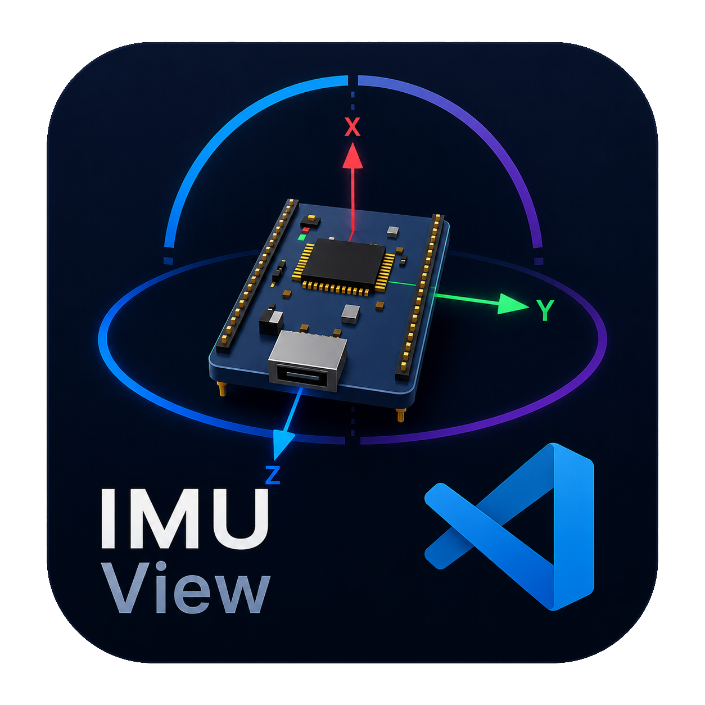
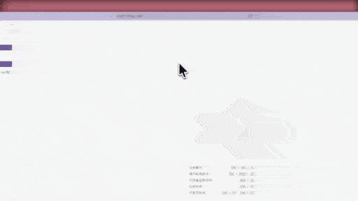
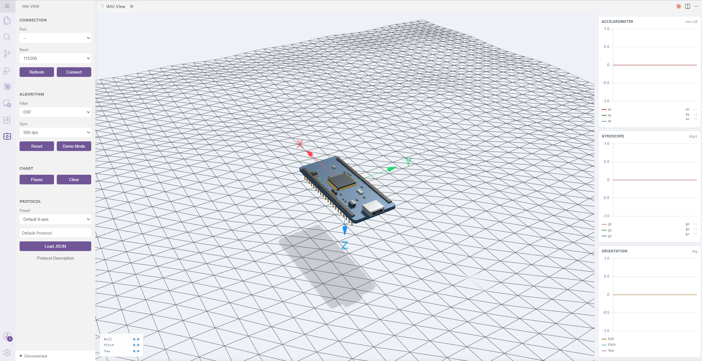

# IMU View

<p align="center">
  
</p>

[English](README.md) | [中文](README_CN.md)

在 VS Code 里实时可视化 IMU 数据。3D 姿态、实时图表、11 种协议预设——接上板子就能用。

<p align="center">
  
</p>

## 功能

- **超轻量** — 安装包不到 1MB，秒装即用
- **3D 姿态** — 模型实时旋转
- **4 种融合算法** — 纯加速度计、互补滤波、Madgwick、EKF
- **实时图表** — 加速度 / 角速度 / 欧拉角，支持暂停和清空
- **11 种协议预设** — MPU6050、WitMotion、ICM-20948、VectorNav、ANO、GPCHC、Xsens 等
- **自定义协议** — JSON 配置任意二进制格式，支持校验
- **串口直连** — USB 直接连接，无需浏览器
- **Demo 模式** — 无硬件也能体验

<p align="center">
  
</p>

## 安装

1. 扩展面板（`Ctrl+Shift+X`）
2. 搜索 **"IMU View"**
3. 安装

## 使用

点击 Activity Bar 的 **IMU** 图标，3D 面板自动打开。

- 选择协议预设或加载自定义 JSON
- 选串口和波特率 → Connect
- 没硬件？点 **Demo Mode**

## 协议

默认二进制包（20 字节）：

```
[0xAA 0xFF] [ax ay az gx gy gz mx my mz] (int16 小端 × 9)
```

### Default 9-axis 示例

```json
{
  "name": "Default Protocol",
  "sync": [170, 255],
  "channels": [
    { "name": "ax", "type": "int16", "endian": "le", "scale": 1, "negate": true, "role": "ax" },
    { "name": "ay", "type": "int16", "endian": "le", "scale": 1, "role": "ay" },
    { "name": "az", "type": "int16", "endian": "le", "scale": 1, "role": "az" },
    { "name": "gx", "type": "int16", "endian": "le", "scale": 1, "role": "gx" },
    { "name": "gy", "type": "int16", "endian": "le", "scale": 1, "negate": true, "role": "gy" },
    { "name": "gz", "type": "int16", "endian": "le", "scale": 1, "negate": true, "role": "gz" },
    { "name": "mx", "type": "int16", "endian": "le", "scale": 1, "role": "mx" },
    { "name": "my", "type": "int16", "endian": "le", "scale": 1, "role": "my" },
    { "name": "mz", "type": "int16", "endian": "le", "scale": 1, "role": "mz" }
  ]
}
```

### 预设列表

| 预设 | 轴数 | 校验 |
|------|------|------|
| Default 9-axis | 加速度 + 陀螺仪 + 磁力计 | — |
| MPU6050 | 6 轴（大端） | — |
| WitMotion JY901 | 加速度 | sum8 |
| BMI160 | 6 轴 | — |
| ICM-20948 | 9 轴（大端） | — |
| LSM6DSL | 6 轴 | — |
| ANO 匿名协议 | 6 轴 | sum8 |
| Xsens MTi | 9 轴 float32 | — |
| VectorNav VNBIN | 9 轴 float32 | CRC16 |
| GPCHC | 6 轴 float32 | XOR |
| NMEA PASHR | 6 轴 缩放 | XOR |

### 自定义 JSON

```json
{
  "name": "My Protocol",
  "sync": [170, 255],
  "channels": [
    { "name": "ax", "type": "int16", "endian": "le", "scale": 1, "role": "ax" },
    { "name": "ay", "type": "int16", "endian": "le", "scale": 1, "role": "ay" },
    { "name": "az", "type": "int16", "endian": "le", "scale": 1, "role": "az" }
  ],
  "checksum": { "type": "xor", "scope": "data" }
}
```

支持类型：`int8` `uint8` `int16` `uint16` `int32` `uint32` `float32`  
校验方式：`sum8` `xor` `crc8` `crc16`

## 融合算法

| 算法 | 适用场景 |
|------|----------|
| Accel Only | 静态，无陀螺仪 |
| Complementary | 计算量低 |
| Madgwick | 均衡 |
| EKF | 最高精度 |

## License

MIT
